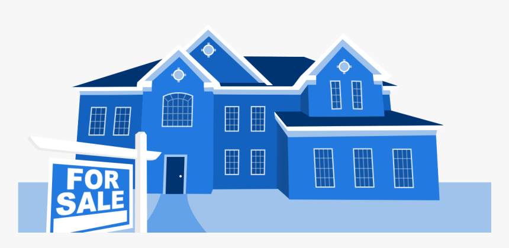

# Boston-House-Prices

People buy and sell houses everyday, buying bigger houses with more rooms is typical, but! Do you think that **Area** and the **Rooms number** are the only attributes of buying a house? What if this houes in a very crowded noisy neighborhood! It sure will extremely affect the apartment price. Since house pricing is one of the most common topics in machine learning, using regression models we can predict house prices only if we feed the model the right data. Using the house data provided by [Kaggle](www.kaggle.com), I manage to analyze the data to find out many insights about ***which attributes affects house pricing and by how much each attribute affect?***. Also a machine learning model is built to predict future prices.

This project is done using `Python 3`.

# Acknowledgments
- The great machine learning course by Prof. [Andrew Ng](https://www.coursera.org/learn/machine-learning).
- The highly practical machine learning course by [Ligency Team](https://www.udemy.com/course/machinelearning/).
